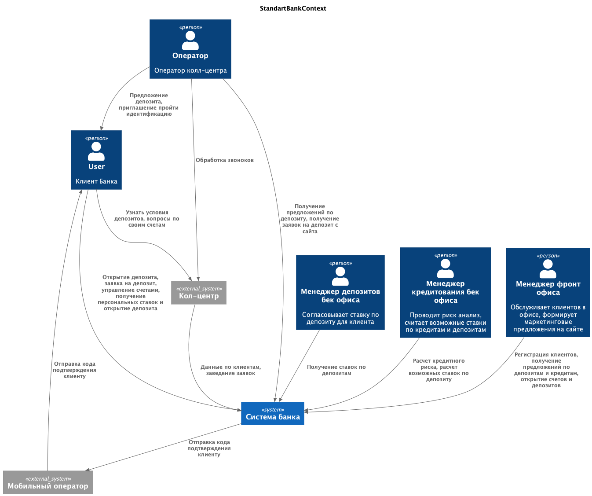
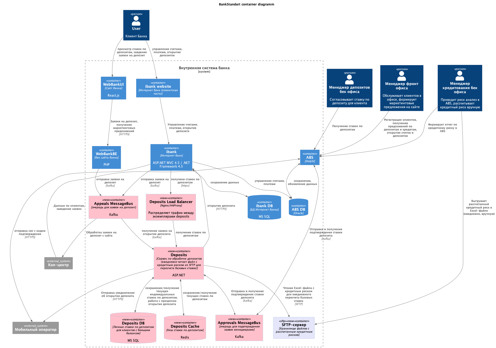
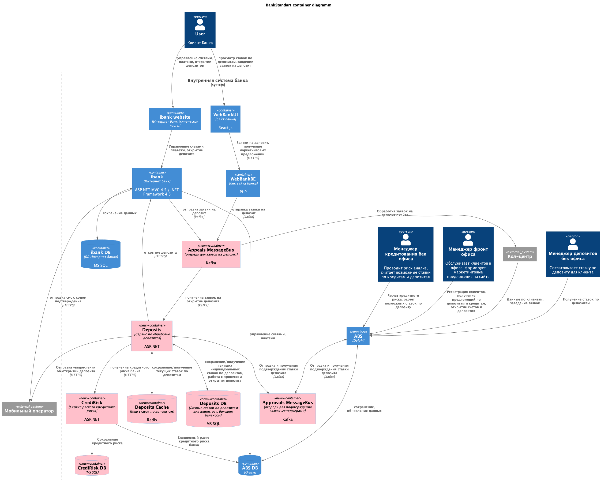

### **Название задачи:** Открытие депозитов онлайн
### **Автор:** Бочаров Георгий
### **Дата:** 14.03.2026
### **Функциональные требования**

| Код | Требования                         | Комментарий  |
|-----|------------------------------------|--------------|
|F|Функциональные (Functionality)
|F1|отображение доступных депозитов на сайте
|F2|возможность подачи заявки на депозит на сайте
|F3|отображение доступных депозитов в интернет банке
|F4|отображение персонализированных ставок по депозитам в интернет банке
|F5|возможность подачи заявки на депозит в интернет банке
|F6|верификация заявки на депозит через смс код в интернет банке
|F7|личный кабинет менеджера в АБС для работы с заявками
|F8|отправка смс уведомления клиенту после открытия депозита
|F9|Возможность работы со ставками по депозитам для сотрудников бек-офисов 

**Сценарии**

|**№**|**Действующие лица или системы**|**Use Case**|**Описание**|
| :-: | :- | :- | :- |
|UC1|Новый клиент|подача заявки на депозит через сайт|Клиент выбирает из доступных варинтов подходящий депозит и оформляет на него заявку, оставляя свои данные. Менеджер перезванивает, рассказывает условия, приглашает прийти в отделение для подтвержденрия личности|
|UC2|Подтвержденный клиент|подача заявки на депозит через интернет-банк|Клиент выбирает из доступных варинтов подходящий депозит и оформляет на него заявку, подтверждая действие кодом из смс, после открытия депозита клиент получает смс|
### **Нефункциональные требования**
Опишите здесь нефункциональные требования и архитектурно значимые требования.

|**№**|**Требование**|
| :-: | :- |
|P1|Отклик по всем операциям сайта < 100ms|
|P2|Отклик по всем операциям интернет банка  < 100ms|
|R1|Режим работы всех сервисов 24/7
|R2|Доступность всех сервисов 99,9% (допустимая недоступность в год - 8ч 45мин)

### **Контекст**
Банк "Стандарт" нуждается в системе открытия депозитов онлайн.

В настоящее время открытие депозитов происходит только при личном обращении клиента в офис. При этом все детали депозита согласовываются менеджерами банка через рабочую почту и файлы. 

При этом банк имеет систему АБС (Автоматизированная банковская система), которая хранит детали открытых продуктов по клиентам, и используется менеджерами для расчета кредитных рисков, ставок по вкладам и кредитам, а также управлением счетами клиентов. Система АБС  представляет из себя монолит и равзернута в инфраструктуре банка. При этом есть резервный ЦОД.

У IT отдела банка есть экспертиза в Java, Delphi, .Net, Oracle и MS SQL. 
При этом интернет банк написан на ASP.NET и в этой команде 10 человек => наибольшая экспертиза.

На этапе MVP предполагается, что заявку на открытие депозита обработает менеджер в бэк-офисе. Он подтвердит условия депозита в АБС банка. При этом клиент должен получить СМС-уведомления после подтверждения размера ставки и открытия депозита.
### **Решение**
#### 1. Язык разработки
Варианты: asp.net, java, php

Предлагается разрабтывать сервисы на ASP.Net так как:
1) в нем есть экспертиза большей части  команды
2) можно переносить код из интернет банка и распиливать монолит
3) он быстрее чем  php, сопоставим по скорости с java

#### 2. Предварительный расчет ставок для пользователей инетрнет банка
Так как в задаче MVP необходимо отразить персонализированные ставки в интернет банке, нужно их предварительно расчитать.

Сотрудники отдела кредитования вручную считают ставки в Excel-файле на основе ставки рефинансирования Центробанка. Они анализируют текущее количество выданных кредитов и депозитов в банке. Итоговая ставка по депозитам зависит от уровня кредитного риска банка. Она обновляется ежедневно — эти показатели передаются в бэк-офис каждый день по почте Excel-файлом.

Если у клиента достаточно много денег на счетах, ему могут согласовать специальные ставки. Чтобы их определить, сотрудники бэк-офиса обращаются в отдел кредитования. Сотрудник кредитования анализирует текущий уровень кредитного риска для банка в своём разделе АБС относительно этого клиента и передаёт данные в письме. Эти данные менеджер депозитов добавляет в Excel-файл и вычисляет на их основе ставку.

#### Будем исходить из предположения, что для расчета базовой ставки по депозитам банка необходимо раз в день расчитывать кредитный риск банка. Также считаем, что персональные предложения по ставке представляют из себя правило, которое повышает процент в зависимости от количества денег на счетах.

Таким образом необходимо каждый день расчитывать кредитный риск банка и давать доступ к этому значению приложению депозитов, для расчета базовых ставок и пересчета предложений для клиентов с большим балансом. 

#### 3. Описание решения
На основании вышеописанного предлагается вынести сервис deposits, который будет отвечать за расчет ставок по депозитам и их отображение в интернет банке. Сервис будет реализован на ASP.NET и работать с базой MS SQL, для максимального соответвтия стеку интернет банка. При этом это будет выделенный микросервис, что позволит горизонтально его масштабировать. Для масштабировани необходим лоад балансер между интернет банком и сервисом депозитов.

Кредитный риск банка будет ежедневно расчитываться менеджером и отправляться на sftp сервер банка. Сервис депозитов ежедневно вычитывает этот файл и перерасчитывает базовые ставки по вкладам с учетом кредитного риска банка. Базовые ставки загружаются в кеш и сохраняются в базу. Кеш позволит быстро отдавать клиенту ставки по депозитам. В базе будет сохраняться история. 

Завяки на оформление депозита будут обрабатываться асинхронно, что минимизирует время отклика на стороне клиента. Заявки с сайта будут вычитываться кол-центром для создания обращений и обратной связи. Заявки из интерент банка обрабатывваются самим сервисом депозитов и после процедуры подтверждения ставки со стороны менеджера бек офиса, сервис будет открывать депозит и отправлять смс клиенту. 

#### 4. Схема решения
Контекстная диаграмма

Контейнерная диаграмма

### **Альтернативы**

#### 1. Модуль депозитов внутри монолита интернет банка
В качестве альтернативы можно рассмотреть выделение модуля депозитов вннутри монолита интернет банка. В этом случае не потребуется отдельно поднимать базу и настраивать балансировщик, что снизит затраты на разработку. Однако при необходимости дальнейшего развития сервиса будет больше затрат на его распределение по микросервисам.

При этом сервис интернет банка не совместим с kafka, поэтому в этом случае заявки будут создаваться синхронно, что увеличит задержку.

Плюсы:
1) быстрее реализовать
   
Минусы:
1) увеличение тех долга
2) отсутствие горизонтального масштабирования
3) большие таймаут создания

#### 2. Микросервис расчета кредитного риска
В решении описан ручной процесс расчета кредитного риска. Это не масштабируется и подвержено влиянию ошибок. Предлагается вариант отдельного микросервиса для расчета кредитного риска. Для начала можно добавить обязательное подтверждение результата со стороны менеджера. Также  можно будет динамически пересчитывать кредитный риск банка, учитывая открытые в течение дня депозиты. 

#### Контейнерная диаграмма
Контейнерная диаграмма

Плюсы:
1) Кредитный риск расчитывается динамически
   
Минусы:
1) наибольшая стоимость разработки

**Недостатки, ограничения, риски**

1) требование экспертизы в Kafka у команды
2) кредитный риск расчитывается вручную

