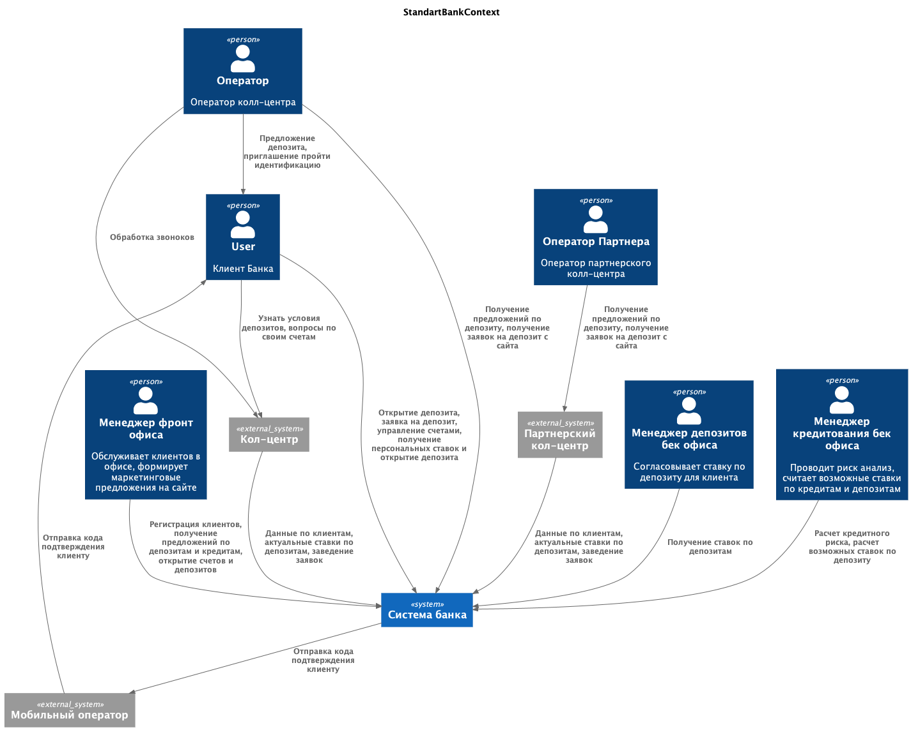
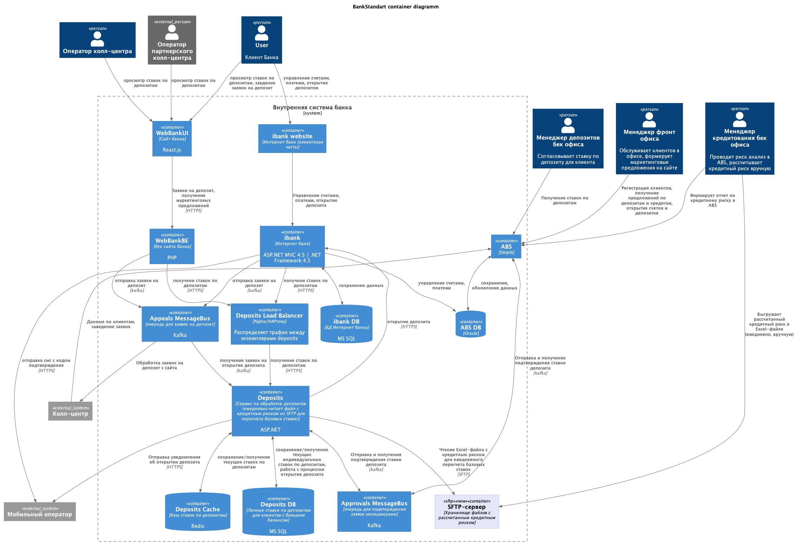
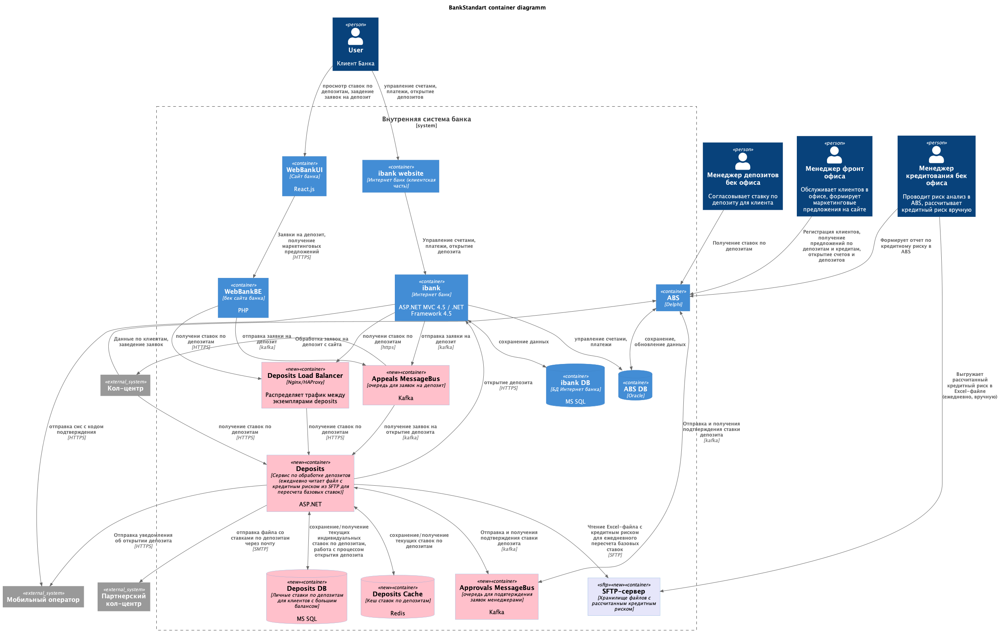

### **Название задачи:** Открытие депозитов онлайн
### **Автор:** Бочаров Георгий
### **Дата:** 14.03.2026
### **Функциональные требования**

| Код | Требования                         |
|-----|------------------------------------|
|F|Функциональные (Functionality)
|F1|отправка ставок по депозитам в кол-центры

**Сценарии**

|**№**|**Действующие лица или системы**|**Use Case**|**Описание**|
| :-: | :- | :- | :- |
|UC1|deposits-service|отправка актуальных ставок в кол-центры|Каждое утро deposits-service расчитывает базовые ставки по депозитам исходя из кредитного риска банка, после этого актуальные базовые ставки отправляются в кол-центры|
### **Нефункциональные требования**
Опишите здесь нефункциональные требования и архитектурно значимые требования.

|**№**|**Требование**|
| :-: | :- |
|R1|Режим работы всех сервисов 24/7
|R2|Доступность всех сервисов 99,9% (допустимая недоступность в год - 8ч 45мин)

### **Контекст**
Банк "Стандарт" нуждается в системе уведомления кол-центров об актуальных ставках по депозиту

Нужно, чтобы сотрудники кол-центра могли проконсультировать клиентов хотя бы по текущим ставкам банка. Для этого надо каким-то образом предоставить их системе доступ к ставкам по депозитам.
Есть риск, что кол-центр будет перегружен. Поэтому необходимо подключить к работе партнёрский кол-центр. При этом важно, чтобы сотрудники партнёрского кол-центра также могли проконсультировать клиентов по актуальным депозитным ставкам.
### **Решение**
#### Описание решения

Самое простое и нетребующее доработок решение - рассказать операторам колл-центров, что в рамках предыдущей доработки на главный сайт банка были добавлены актуальные ставки по депозитам. При этом каждый день эти ставки обновляются после пересчета относительно кредитного риска банка.

#### Схема решения
Контекстная диаграмма

Контейнерная диаграмма

### **Альтернативы**

#### 1. Ежедневная отправка ставок по депозитам на почту в колл-центры
Если возникнет риск не успеть реализовать публикацию ставки на странице банка, можно предусмотерть отправку ставок по депозитам на почту в кол-центр партнера. 

Плюсы:
1) данное решение не зависит от реализации отображения ставок на сайте банка
   
Минусы:
1) Неудобный интерфейс для операторов - придется каждый день искать письмо и не путать его с письмами предыдущих дней

#### Контейнерная диаграмма
Контейнерная диаграмма

#### 2. Разработать личный кабинет для сотрудников колл-центра

Плюсы:
1) Расширяемость решения
   
Минусы:
1) Требуются затраты на разработку и поддержку

**Недостатки, ограничения, риски**

1) При расширении требования к данным со стороны операторов партенрского колл-центра придетс разрабатывать новую систему

